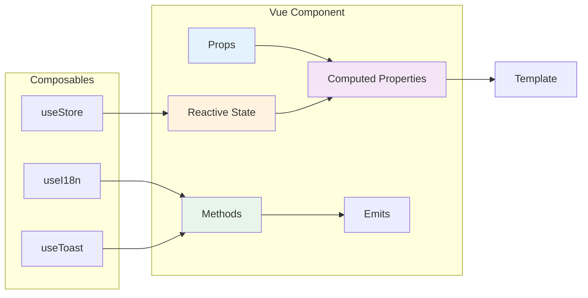

# n8n Architecture & Contribution Flow

> **Visual guide to n8n's architecture and development workflow**

## System Architecture

```mermaid
graph TB
    subgraph "Frontend Layer"
        UI[Vue 3 Editor UI<br/>packages/editor-ui]
        DS[Design System<br/>@n8n/design-system]
        I18N[i18n Translations<br/>@n8n/i18n]
        STORES[Pinia Stores<br/>State Management]
    end

    subgraph "API Layer"
        TYPES[@n8n/api-types<br/>Shared TypeScript Interfaces]
    end

    subgraph "Backend Layer"
        CTRL[Controllers<br/>HTTP Endpoints]
        SVC[Services<br/>Business Logic]
        REPO[Repositories<br/>Data Access]
        DB[(Database<br/>SQLite/PostgreSQL)]
    end

    subgraph "Core Engine"
        WF[Workflow Engine<br/>packages/workflow]
        CORE[Execution Core<br/>packages/core]
        NODES[Nodes<br/>packages/nodes-base]
    end

    UI --> DS
    UI --> I18N
    UI --> STORES
    UI --> TYPES
    TYPES --> CTRL
    CTRL --> SVC
    SVC --> REPO
    REPO --> DB
    SVC --> CORE
    CORE --> WF
    CORE --> NODES

    style UI fill:#42b883
    style DS fill:#42b883
    style TYPES fill:#ffd700
    style CTRL fill:#68a063
    style SVC fill:#68a063
    style REPO fill:#68a063
    style WF fill:#ff6b6b
    style CORE fill:#ff6b6b
```

## Request Flow


## Component Architecture



## Backend Module Structure

```mermaid
graph TD
    subgraph "Controller Layer"
        C1[UsersController<br/>@RestController]
        C2[WorkflowsController<br/>@RestController]
    end

    subgraph "Service Layer"
        S1[UserService<br/>@Service]
        S2[WorkflowService<br/>@Service]
        S3[EventService<br/>@Service]
    end

    subgraph "Repository Layer"
        R1[UserRepository<br/>extends Repository]
        R2[WorkflowRepository<br/>extends Repository]
    end

    subgraph "Database"
        E1[User Entity]
        E2[Workflow Entity]
    end

    C1 --> S1
    C2 --> S2
    S1 --> R1
    S2 --> R2
    S1 --> S3
    S2 --> S3
    R1 --> E1
    R2 --> E2

    style C1 fill:#4caf50
    style C2 fill:#4caf50
    style S1 fill:#2196f3
    style S2 fill:#2196f3
    style S3 fill:#2196f3
    style R1 fill:#ff9800
    style R2 fill:#ff9800
```

## Development Workflow


## Testing Strategy


## Monorepo Package Dependencies

```mermaid
graph TD
    API_TYPES[@n8n/api-types]
    WORKFLOW[n8n-workflow]
    CORE[n8n-core]
    CLI[n8n CLI]
    EDITOR[editor-ui]
    DESIGN[design-system]
    I18N[@n8n/i18n]
    NODES[nodes-base]
    DI[@n8n/di]
    CONFIG[@n8n/config]

    API_TYPES --> CLI
    API_TYPES --> EDITOR
    WORKFLOW --> CORE
    WORKFLOW --> NODES
    CORE --> CLI
    NODES --> CLI
    DESIGN --> EDITOR
    I18N --> EDITOR
    DI --> CLI
    CONFIG --> CLI

    style API_TYPES fill:#ffd700
    style CLI fill:#68a063
    style EDITOR fill:#42b883
    style DESIGN fill:#42b883
    style CORE fill:#ff6b6b
```

## Data Flow: Creating a User


## Node Development Flow

```mermaid
graph TB
    START[Create Node] --> DESC[Define Node Description<br/>INodeTypeDescription]
    DESC --> PROPS[Define Properties<br/>Parameters & Options]
    PROPS --> DECIDE{Node Type?}
    
    DECIDE -->|Programmatic| EXEC[Implement execute()<br/>Custom Logic]
    DECIDE -->|Declarative| ROUTING[Define Routing<br/>requestDefaults]
    DECIDE -->|Trigger| TRIGGER[Implement trigger()<br/>or webhook()]
    
    EXEC --> CREDS[Add Credentials<br/>if needed]
    ROUTING --> CREDS
    TRIGGER --> CREDS
    
    CREDS --> TEST[Write Tests<br/>Unit + Workflow]
    TEST --> ICON[Add Icon SVG]
    ICON --> DOCS[Add Documentation]
    DOCS --> DONE[Node Complete]

    style START fill:#4caf50
    style DONE fill:#4caf50
    style TEST fill:#ff9800
```

## CI/CD Pipeline


## State Management Flow (Pinia)


## Error Handling Flow


---

## Key Takeaways

### Frontend Development
1. **Components** → Use Vue 3 Composition API
2. **State** → Manage with Pinia stores
3. **Styling** → Always use CSS variables
4. **Text** → All UI text must use i18n
5. **Reusability** → Pure components go in design-system

### Backend Development
1. **Structure** → Controller → Service → Repository
2. **DI** → Use `@Service()` and constructor injection
3. **Types** → Define DTOs in `@n8n/api-types`
4. **Errors** → Use proper error classes (not ApplicationError)
5. **Events** → Use EventService for decoupled communication

### Testing
1. **Unit** → Mock all dependencies
2. **Integration** → Test with real database
3. **E2E** → Test full user flows with Playwright
4. **Coverage** → Aim for high coverage on critical paths

### Code Quality
1. **TypeScript** → No `any`, no `as` casting
2. **Linting** → Run before committing
3. **Formatting** → Use Biome
4. **Tests** → Required for all changes

---

For detailed implementation examples, see [DEVELOPER_CONTRIBUTION_GUIDE.md](./DEVELOPER_CONTRIBUTION_GUIDE.md)
