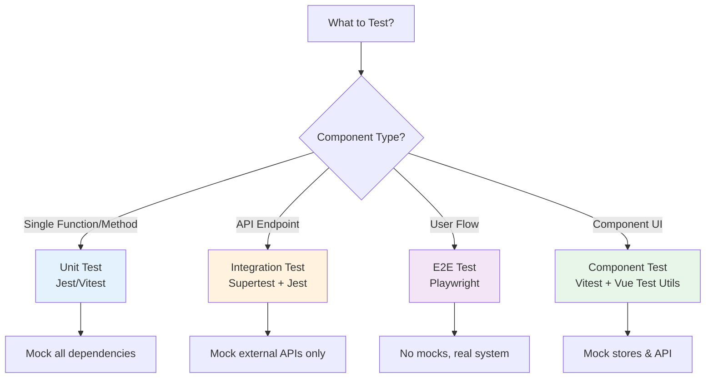

# n8n Developer Decision Guide

> **Quick reference for making architectural and implementation decisions**

This guide helps you make the right choices when contributing to n8n by providing decision matrices, comparison tables, and best practices.

---

## Table of Contents

- [When to Use What](#when-to-use-what)
- [Frontend Decisions](#frontend-decisions)
- [Backend Decisions](#backend-decisions)
- [Testing Decisions](#testing-decisions)
- [Performance Considerations](#performance-considerations)
- [Common Scenarios](#common-scenarios)

---

## When to Use What

### Frontend: Component Location Decision

```
┌─────────────────────────────────────────────────────────────┐
│ Is the component reusable across multiple features?         │
└────────────┬────────────────────────────────────────────────┘
             │
      ┌──────┴──────┐
      │     YES     │
      └──────┬──────┘
             │
      ┌──────▼──────────────────────────────────────────────┐
      │ Is it a pure presentational component (no business  │
      │ logic, no API calls, no workflow-specific code)?    │
      └──────┬──────────────────────────────────────────────┘
             │
      ┌──────┴──────┐
      │     YES     │
      └──────┬──────┘
             │
      ┌──────▼──────────────────────────────────────────────┐
      │ ✅ Place in @n8n/design-system                      │
      │    packages/@n8n/design-system/src/components/      │
      └─────────────────────────────────────────────────────┘
             
      ┌──────┐
      │  NO  │
      └──────┘
             │
      ┌──────▼──────────────────────────────────────────────┐
      │ ✅ Place in editor-ui                               │
      │    packages/editor-ui/src/components/               │
      └─────────────────────────────────────────────────────┘
```

### Backend: Where to Put Logic

| Concern | Location | Example |
|---------|----------|---------|
| HTTP routing, request validation | **Controller** | `@Get('/:id')`, `@Body payload` |
| Business logic, orchestration | **Service** | User creation workflow, sending emails |
| Data access, queries | **Repository** | `findByEmail()`, complex queries |
| Cross-cutting concerns | **Middleware** | Authentication, logging, rate limiting |
| Background jobs | **Queue Worker** | Email sending, data processing |
| Real-time events | **EventService** | `emit('user-created')` |

### Testing: Which Test Type to Use



---

## Frontend Decisions

### State Management: Local vs Store

| Use Local State (ref/reactive) | Use Pinia Store |
|--------------------------------|-----------------|
| ✅ Component-specific UI state | ✅ Shared across multiple components |
| ✅ Form inputs | ✅ User authentication state |
| ✅ Toggle states | ✅ Workflow data |
| ✅ Temporary data | ✅ Cached API responses |
| ✅ Modal visibility | ✅ Global settings |

**Example - Local State:**
```vue
<script setup>
const isModalOpen = ref(false);
const searchQuery = ref('');
</script>
```

**Example - Pinia Store:**
```typescript
// When data is needed in multiple components
export const useWorkflowsStore = defineStore('workflows', () => {
  const workflows = ref([]);
  const activeWorkflow = ref(null);
  return { workflows, activeWorkflow };
});
```

### CSS: When to Use What

| Approach | When to Use | Example |
|----------|-------------|---------|
| **CSS Variables** | Always for colors, spacing, typography | `var(--spacing--md)` |
| **Scoped Styles** | Component-specific styles | `<style scoped>` |
| **Global Styles** | Application-wide resets, utilities | `main.scss` |
| **Inline Styles** | Dynamic styles based on props | `:style="{ width: props.width }"` |
| **CSS Modules** | Avoid - not used in n8n | ❌ |
| **Tailwind** | Avoid - not used in n8n | ❌ |

### Composition API: Composable vs Component

| Create Composable | Keep in Component |
|-------------------|-------------------|
| ✅ Reusable logic across components | ✅ Component-specific logic |
| ✅ API calls | ✅ UI event handlers |
| ✅ Form validation | ✅ Simple computed properties |
| ✅ WebSocket connections | ✅ Template-specific methods |
| ✅ Complex state management | ✅ One-off calculations |

**Example Composable:**
```typescript
// composables/useUserApi.ts
export function useUserApi() {
  const loading = ref(false);
  const error = ref(null);
  
  async function fetchUsers() {
    loading.value = true;
    try {
      return await api.getUsers();
    } catch (e) {
      error.value = e;
    } finally {
      loading.value = false;
    }
  }
  
  return { loading, error, fetchUsers };
}
```

---

## Backend Decisions

### Error Handling: Which Error Class to Use

| Scenario | Error Class | HTTP Status | Example |
|----------|-------------|-------------|---------|
| Invalid user input | `BadRequestError` | 400 | Invalid email format |
| Resource not found | `NotFoundError` | 404 | User ID doesn't exist |
| Insufficient permissions | `ForbiddenError` | 403 | Not authorized to delete |
| Unauthorized access | `UnauthorizedError` | 401 | Invalid token |
| Expected operational error | `OperationalError` | 500 | Database connection failed |
| User-caused issue | `UserError` | 400 | Invalid workflow config |
| Unexpected bug | `UnexpectedError` | 500 | Null pointer, unexpected state |

**Decision Tree:**
```
Is it the user's fault?
├─ YES → Is it about permissions?
│        ├─ YES → ForbiddenError (403)
│        └─ NO → BadRequestError (400) or UserError (400)
└─ NO → Is it expected to happen?
         ├─ YES → OperationalError (500)
         └─ NO → UnexpectedError (500)
```

### Database Queries: Where to Put Them

| Query Complexity | Location | Example |
|------------------|----------|---------|
| Simple find by ID | Repository method | `findById(id)` |
| Find with relations | Repository method | `findWithRelations(id)` |
| Complex joins | Repository method | `buildComplexQuery()` |
| Business logic + query | Service + Repository | Service calls multiple repo methods |
| Aggregations | Repository method | `countByStatus()` |
| Transactions | Service method | Service manages transaction |

**Example:**
```typescript
// ✅ CORRECT - Complex query in repository
class UserRepository {
  async findActiveUsersWithWorkflows() {
    return this.createQueryBuilder('user')
      .leftJoinAndSelect('user.workflows', 'workflow')
      .where('user.disabled = :disabled', { disabled: false })
      .getMany();
  }
}

// ✅ CORRECT - Business logic in service
class UserService {
  async deactivateUser(userId: string) {
    await this.manager.transaction(async (trx) => {
      await trx.update(User, { id: userId }, { disabled: true });
      await trx.delete(Session, { userId });
      this.eventService.emit('user-deactivated', { userId });
    });
  }
}
```

### API Design: REST Endpoint Patterns

| Operation | Method | Endpoint | Example |
|-----------|--------|----------|---------|
| List all | GET | `/resources` | `GET /users` |
| Get one | GET | `/resources/:id` | `GET /users/123` |
| Create | POST | `/resources` | `POST /users` |
| Update (full) | PUT | `/resources/:id` | `PUT /users/123` |
| Update (partial) | PATCH | `/resources/:id` | `PATCH /users/123` |
| Delete | DELETE | `/resources/:id` | `DELETE /users/123` |
| Custom action | POST | `/resources/:id/action` | `POST /users/123/activate` |
| Nested resource | GET | `/resources/:id/nested` | `GET /users/123/workflows` |

---

## Testing Decisions

### Test Coverage: What to Test

| Priority | What to Test | Test Type |
|----------|--------------|-----------|
| 🔴 **Critical** | Authentication & authorization | Unit + Integration + E2E |
| 🔴 **Critical** | Data persistence (CRUD) | Integration |
| 🔴 **Critical** | Workflow execution | Integration + E2E |
| 🟡 **High** | Business logic in services | Unit |
| 🟡 **High** | API endpoints | Integration |
| 🟡 **High** | User flows | E2E |
| 🟢 **Medium** | UI components | Component tests |
| 🟢 **Medium** | Utilities & helpers | Unit |
| ⚪ **Low** | Simple getters/setters | Skip or minimal |
| ⚪ **Low** | Type definitions | TypeScript handles |

### Mocking Strategy

| Test Type | What to Mock | What to Keep Real |
|-----------|--------------|-------------------|
| **Unit Test** | Everything except the unit under test | The function/class being tested |
| **Integration Test** | External APIs, email services | Database, internal services |
| **E2E Test** | External APIs (if flaky) | Everything else |
| **Component Test** | Stores, API calls | Component logic, computed properties |

**Example:**
```typescript
// Unit Test - Mock everything
describe('UserService', () => {
  let service: UserService;
  let mockRepo: jest.Mocked<UserRepository>;
  let mockEventService: jest.Mocked<EventService>;
  
  beforeEach(() => {
    mockRepo = mock<UserRepository>();
    mockEventService = mock<EventService>();
    service = new UserService(mockRepo, mockEventService);
  });
});

// Integration Test - Real database
describe('UserController', () => {
  let app: Express;
  let db: DataSource;
  
  beforeAll(async () => {
    db = await createTestDatabase();
    app = createTestApp(db);
  });
  
  it('should create user', async () => {
    const response = await request(app)
      .post('/users')
      .send({ email: 'test@test.com' });
    
    expect(response.status).toBe(201);
  });
});
```

---

## Performance Considerations

### Frontend Performance

| Optimization | When to Use | How |
|--------------|-------------|-----|
| **Computed Properties** | Derived state that changes frequently | `const fullName = computed(() => ...)` |
| **Debouncing** | Search inputs, API calls on input | `useDebounceFn(fn, DEBOUNCE_TIME.INPUT.SEARCH)` |
| **Lazy Loading** | Routes, large components | `component: () => import('./Heavy.vue')` |
| **Virtual Scrolling** | Long lists (>100 items) | Use virtual scroll library |
| **Memoization** | Expensive calculations | `useMemoize()` or `computed()` |
| **v-show vs v-if** | Toggled frequently: v-show, Rarely: v-if | `v-show="isVisible"` |

### Backend Performance

| Optimization | When to Use | Example |
|--------------|-------------|---------|
| **Eager Loading** | Avoid N+1 queries | `.leftJoinAndSelect('user.workflows')` |
| **Pagination** | Large datasets | `take(20).skip(offset)` |
| **Caching** | Frequently accessed, rarely changed data | Redis cache |
| **Indexing** | Frequently queried columns | Database indexes |
| **Batch Operations** | Multiple similar operations | `repository.save([...users])` |
| **Background Jobs** | Long-running tasks | Bull queue |

### Development Mode Performance

| Issue | Solution |
|-------|----------|
| Slow hot reload | Use selective dev mode: `pnpm dev:be` or `pnpm dev:fe` |
| High CPU usage | Disable hot reload: remove `N8N_DEV_RELOAD=true` |
| Slow builds | Build only changed packages: `pnpm build --filter=changed` |
| Memory issues | Increase Node memory: `NODE_OPTIONS=--max-old-space-size=4096` |

---

## Common Scenarios

### Scenario 1: Adding a New Feature

**Question:** I need to add user profile editing. Where do I start?

**Answer:**
1. ✅ Define types in `@n8n/api-types`
   ```typescript
   export const updateUserProfileSchema = z.object({
     firstName: z.string(),
     lastName: z.string(),
     avatar: z.string().url().optional(),
   });
   ```

2. ✅ Create/update controller
   ```typescript
   @Patch('/:id/profile')
   async updateProfile(@Param('id') id: string, @Body payload: UpdateProfileDto) {
     return await this.userService.updateProfile(id, payload);
   }
   ```

3. ✅ Implement service
   ```typescript
   async updateProfile(id: string, data: UpdateProfileDto) {
     const user = await this.userRepo.findById(id);
     Object.assign(user, data);
     return await this.userRepo.save(user);
   }
   ```

4. ✅ Add frontend API call
   ```typescript
   export async function updateUserProfile(id: string, data: UpdateProfileDto) {
     return await makeRestApiRequest('PATCH', `/users/${id}/profile`, data);
   }
   ```

5. ✅ Create/update component
6. ✅ Add translations
7. ✅ Write tests

### Scenario 2: Fixing a Bug

**Question:** Users report that workflow execution fails silently. How do I debug?

**Answer:**
1. ✅ **Reproduce** - Create minimal test case
2. ✅ **Add logging** - Use `this.logger.debug()` in services
3. ✅ **Check error handling** - Ensure errors are caught and logged
4. ✅ **Add test** - Write test that reproduces the bug
5. ✅ **Fix** - Implement fix
6. ✅ **Verify** - Ensure test passes
7. ✅ **Add monitoring** - Add telemetry if needed

### Scenario 3: Improving Performance

**Question:** The user list page is slow with 1000+ users. How do I optimize?

**Answer:**

**Backend:**
```typescript
// ❌ BEFORE - Loads all users
async getUsers() {
  return await this.userRepo.find();
}

// ✅ AFTER - Pagination + selective loading
async getUsers(options: { skip: number; take: number; select?: string[] }) {
  const query = this.userRepo.createQueryBuilder('user');
  
  if (options.select) {
    query.select(options.select.map(f => `user.${f}`));
  }
  
  return await query
    .skip(options.skip)
    .take(options.take)
    .getManyAndCount();
}
```

**Frontend:**
```vue
<!-- ✅ Add virtual scrolling for large lists -->
<template>
  <RecycleScroller
    :items="users"
    :item-size="60"
    key-field="id"
  >
    <template #default="{ item }">
      <UserListItem :user="item" />
    </template>
  </RecycleScroller>
</template>
```

### Scenario 4: Adding Internationalization

**Question:** I added a new UI component. How do I make it translatable?

**Answer:**
1. ✅ Add translations to `packages/@n8n/i18n/src/locales/en.json`
   ```json
   {
     "myFeature": {
       "title": "My Feature",
       "description": "This is my feature",
       "button": {
         "save": "Save Changes",
         "cancel": "Cancel"
       }
     }
   }
   ```

2. ✅ Use in component
   ```vue
   <script setup>
   import { useI18n } from '@/composables/useI18n';
   const i18n = useI18n();
   </script>
   
   <template>
     <div>
       <h1>{{ i18n.baseText('myFeature.title') }}</h1>
       <p>{{ i18n.baseText('myFeature.description') }}</p>
       <button>{{ i18n.baseText('myFeature.button.save') }}</button>
     </div>
   </template>
   ```

3. ✅ For interpolation
   ```typescript
   const message = i18n.baseText('myFeature.welcome', {
     interpolate: { name: userName }
   });
   // Translation: "Welcome, {name}!"
   ```

### Scenario 5: Creating a Reusable Component

**Question:** I need a custom button that will be used across the app. Where should it go?

**Decision Tree:**
```
Is it used in multiple features?
├─ YES → Does it have workflow-specific logic?
│        ├─ NO → ✅ @n8n/design-system
│        └─ YES → ✅ editor-ui/src/components
└─ NO → ✅ editor-ui/src/components (feature-specific)
```

**If in design-system:**
```vue
<!-- packages/@n8n/design-system/src/components/N8nButton/N8nButton.vue -->
<script setup lang="ts">
interface Props {
  type?: 'primary' | 'secondary';
  size?: 'small' | 'medium' | 'large';
}

const props = withDefaults(defineProps<Props>(), {
  type: 'primary',
  size: 'medium',
});
</script>

<template>
  <button :class="['n8n-button', `n8n-button--${type}`, `n8n-button--${size}`]">
    <slot />
  </button>
</template>

<style scoped>
.n8n-button {
  padding: var(--spacing--sm);
  font-size: var(--font-size--sm);
}
</style>
```

---

## Decision Checklist

Before implementing a feature, ask yourself:

### Architecture
- [ ] Does this belong in frontend, backend, or both?
- [ ] Should this be a new package or part of existing one?
- [ ] Do I need to update `@n8n/api-types`?

### Code Organization
- [ ] Is this logic reusable? Where should it live?
- [ ] Should this be a service, repository, or controller?
- [ ] Does this need a Pinia store or local state?

### Testing
- [ ] What test types do I need? (Unit, Integration, E2E)
- [ ] What should I mock vs keep real?
- [ ] Have I covered edge cases?

### Performance
- [ ] Will this handle large datasets?
- [ ] Do I need pagination, caching, or lazy loading?
- [ ] Are there any N+1 query issues?

### Internationalization
- [ ] Have I added translations for all UI text?
- [ ] Are error messages translatable?

### Accessibility
- [ ] Are interactive elements keyboard accessible?
- [ ] Do I have proper ARIA labels?
- [ ] Is the contrast ratio sufficient?

### Documentation
- [ ] Do I need to update documentation?
- [ ] Are complex parts commented?
- [ ] Is the PR description clear?

---

## Quick Reference Tables

### HTTP Status Codes

| Code | Meaning | When to Use |
|------|---------|-------------|
| 200 | OK | Successful GET, PATCH, PUT |
| 201 | Created | Successful POST |
| 204 | No Content | Successful DELETE |
| 400 | Bad Request | Invalid input |
| 401 | Unauthorized | Not authenticated |
| 403 | Forbidden | Not authorized |
| 404 | Not Found | Resource doesn't exist |
| 409 | Conflict | Duplicate resource |
| 500 | Internal Server Error | Unexpected error |

### TypeScript Types

| Use Case | Type |
|----------|------|
| Unknown data | `unknown` (not `any`) |
| Function that doesn't return | `void` |
| Function that never returns | `never` |
| Optional property | `property?: string` |
| Nullable | `string \| null` |
| Union types | `'success' \| 'error'` |
| Array | `string[]` or `Array<string>` |
| Promise | `Promise<User>` |

### Git Commit Types

| Type | Description | Changelog |
|------|-------------|-----------|
| feat | New feature | ✅ Yes |
| fix | Bug fix | ✅ Yes |
| perf | Performance improvement | ✅ Yes |
| docs | Documentation only | ❌ No |
| refactor | Code refactoring | ❌ No |
| test | Adding tests | ❌ No |
| build | Build system changes | ❌ No |
| ci | CI/CD changes | ❌ No |
| chore | Maintenance | ❌ No |

---

## Additional Resources

- **Full Guide**: [DEVELOPER_CONTRIBUTION_GUIDE.md](./DEVELOPER_CONTRIBUTION_GUIDE.md)
- **Quick Start**: [DEVELOPER_QUICK_START.md](./DEVELOPER_QUICK_START.md)
- **Architecture**: [ARCHITECTURE_DIAGRAM.md](./ARCHITECTURE_DIAGRAM.md)
- **Contributing**: [CONTRIBUTING.md](./CONTRIBUTING.md)

---

**When in doubt, check existing code for similar patterns or ask in the community forum!** 🚀
